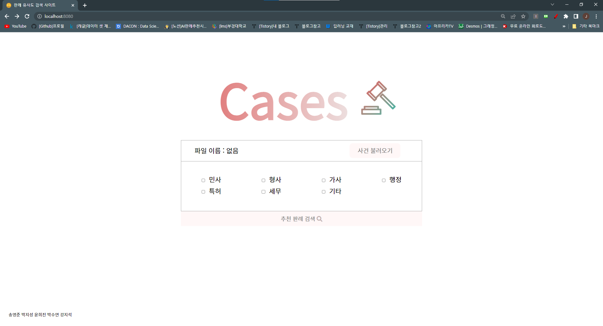
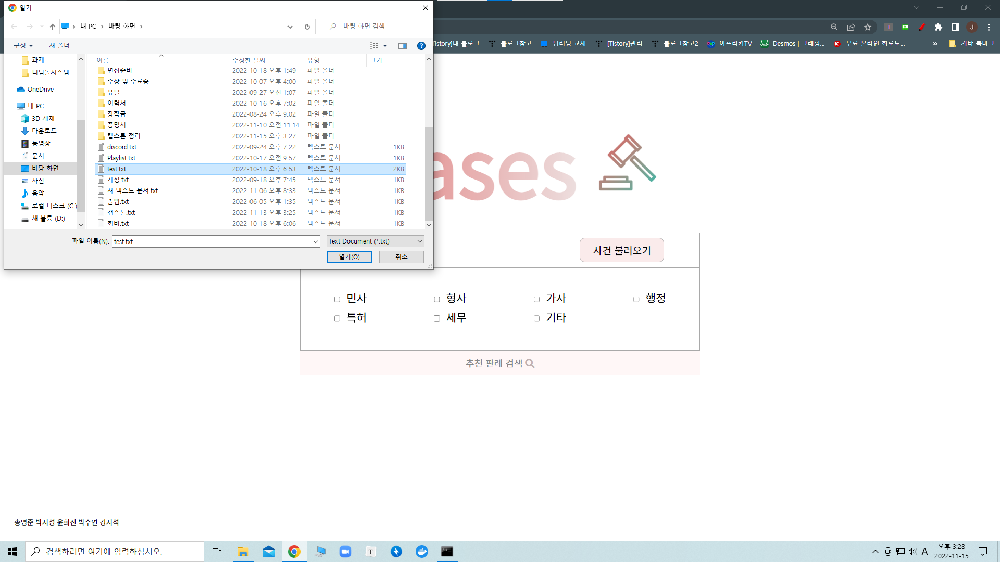
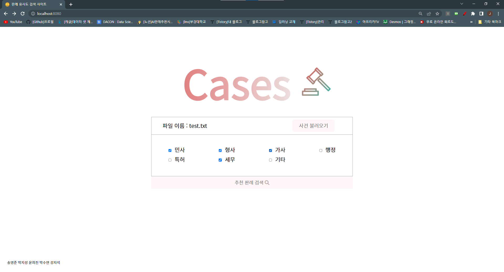
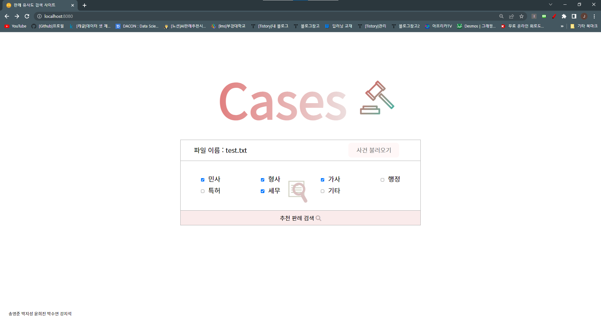
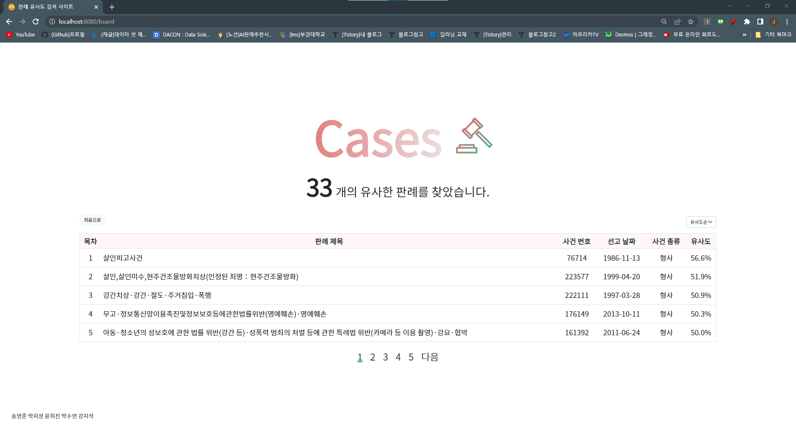
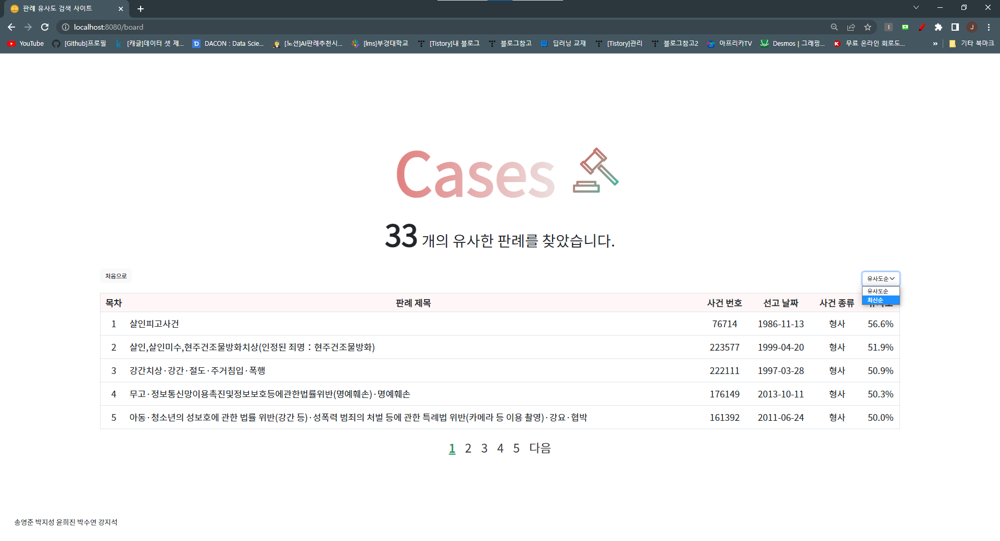
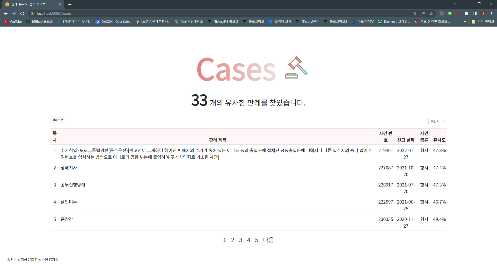
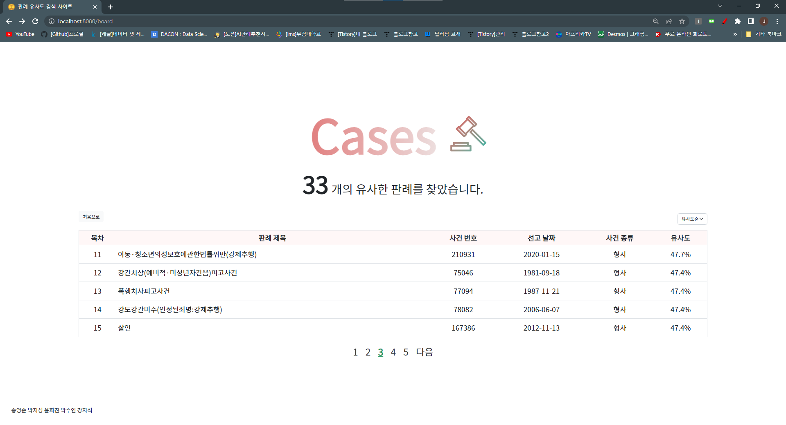
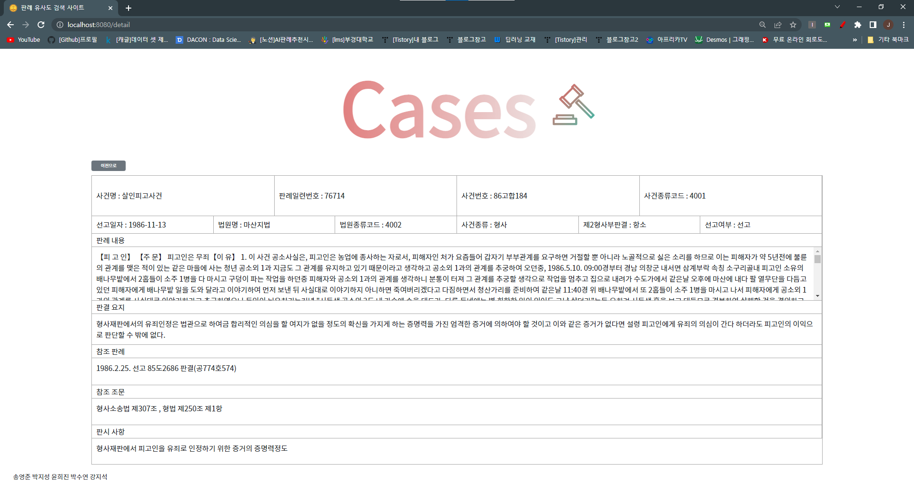

# 👵AI 판례 추천 시스템

> User의 사건 내용을 입력받고 그 내용과 가장 비슷한 판례를 추천하는 시스템입니다.
>
> [[Notion]Workspace](https://opposite-voice-903.notion.site/AI-c8d65d3e88534d88ad1179071d3e8582)

## 📅 Project calendar

- 03.14 ~ 03.26 : 주제 선정
- 04.01 ~ 06.24 : 시스템 설계 및 데이터 수집
- 06.27 ~ 08.31 : Text Embedding Model Training, 시스템 설계 개선
- 09.01~10.31 : modules test, python - nodejs 연동, Web 구현완료
- 11.01~11.18 : 개선사항 업데이트
- 11.18~11.25 : 프로젝트 완료

## 🔜Version History

- ProtoType - version 0.1
  - Basic Web (streamlit)
  - Basic ML Model
  - Data : precedent - 82467
  - [Prototype version 0.1 살펴보기](https://opposite-voice-903.notion.site/4b167381360a49b1a00c424844638abe?v=5ff807a648054562ae1250b655f3af88&p=304fd2ff0b0148acae7d39ce7dd54bdf&pm=s)
- Version 1.0
  - Web (Node.js)
  - Improved ML Model
  - Data : precedent - 85024
  - [Version 1.0 살펴보기]()

## 💽 Usage data

- 판례 데이터 : 85024개

## :hammer:Tool

- Web

  

  

- AI

  

  

- DB

  

- Prototype

  

## 🔎 Project outline

## :house:Stakeholder

- [박지성](https://github.com/wjsrlahrlco1998) - **P**roject **M**anager
- [강지석](https://github.com/pknu-js) - **P**roject **E**ngineer
- [박수연](https://github.com/suyeon12) - **P**roject **E**ngineer
- [송영준](https://github.com/songyj9605) - **P**roject **E**ngineer

- [윤희진](https://github.com/yoonhj99) - **P**roject **E**ngineer

