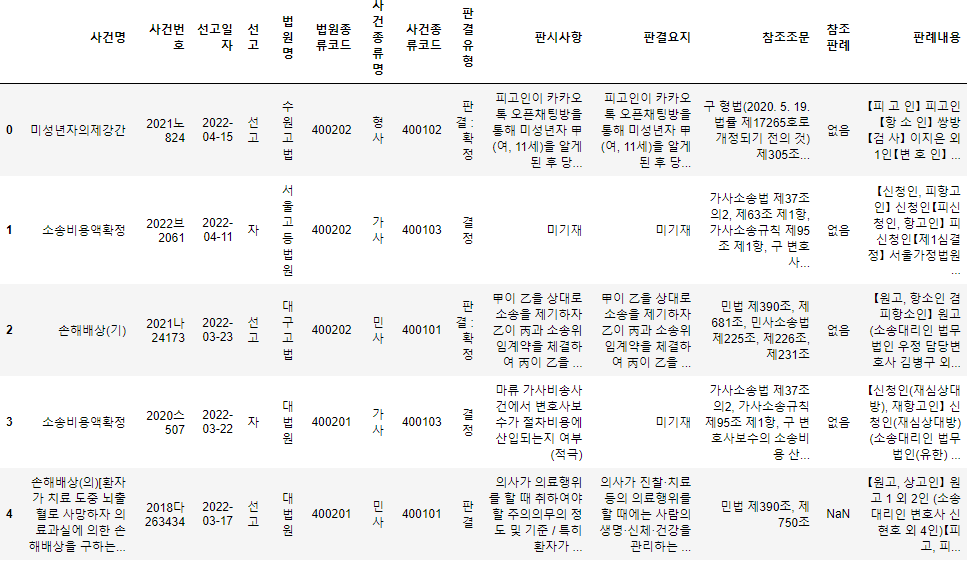

# 판례 데이터 크롤링

## 1. 데이터 살펴보기

- 개수 : 약 8만개
- Feature
  - 판례일련번호 : 판례 고유 번호
  - 사건명 : 사건의 제목
  - 사건번호 : 사건번호
  - 선고일자 : 사건이 선고된 일자
  - 선고 : 선고 종류
  - 법원명 : 선고 법원
  - 법원종류코드 : 법원 고유 코드
  - 사건종류명 : 사건 분류
  - 사건종류코드 : 사건 종류 고유 코드
  - 판결유형 : 판결 여부
  - 판시사항 : 주요 판시사항
  - 판결요지 : 판례 요약
  - 참조조문 : 참조 법률 조항
  - 참조판례 : 참조 판례
  - 판례내용 : 판례 본문

